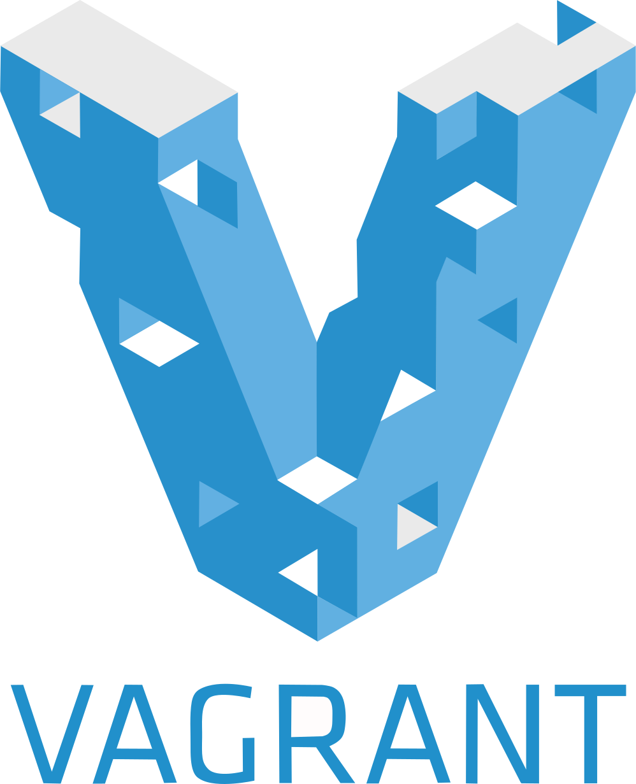

:title: Introduction to Vagrant
:author: BabuSubashChandar C
:skip-help: true
:data-transition-duration: 1500
:css: vagrant.css
:auto-console: true

Introduction to Vagrant based approach to handle development environments.

----

.. raw:: html

    <link rel="stylesheet" href="https://maxcdn.bootstrapcdn.com/font-awesome/4.6.3/css/font-awesome.min.css">

:data-scale: 10
:id: title

**Introduction to Vagrant**
===========================

BabuSubashChandar C

babusubashchandar@zilogic.com

.. note::

    Introduction to Vagrant based approach to handle development environments.

----

:data-y: r3000
:data-scale: 1

.. note::

    * Virtual Machines - VMs - these terms would be familiar to most
      of the people nowadays.

    * Vagrant makes it easy to work with Virtual machines.

----

:data-x: r-150
:data-y: r-250
:data-scale: 0.08
:data-rotate: 30
:id: problem-statement-1

**Worked on my machine!**
=========================

.. note::

    * Almost I guess all of us would ve fallen into a situation where
      people were startled by the fact that something is not working
      on their peer's machine which was working fine on their
      machines.

    * There are numerous reasons for someone to bump into such
      situation.

      * Operating system

      * Libraries installed

      * or it can be anything

----

:data-x: r-40
:data-y: r38
:data-scale: 0.01
:data-rotate: -40
:id: problem-statement-2

**If I had my text editor!**
============================

.. note::

    * We always love certain text editors, my love is emacs. And for
      someone else it could be vim. This can cause a person to lose
      concentration on what they are intented to do.

----

:data-x: r70
:data-y: r170
:data-rotate: 30
:data-scale: 0.03
:data-perspective: 20
:id: problem-statement-3

*Oops, I was using Java1.7 not Java1.5*
=======================================

.. note::

    * There are scenarios where people get into trouble in
      understanding why certain application is misbehaving or not
      working on certain environments.

    * For this people thought of having these softwares installed in a
      Virtual environment and distribute it across the team; where
      people can have all their development.

----

:data-x: r120
:data-y: r110
:data-rotate: -32
:data-perspective: 20
:data-scale: 0.04
:id: problem-statement-4

**Ok! Enough with the torture!**
================================

.. note::

    * If we wanted to dispose off the changes that we made on our VM
      and start freshly, it is nearly impossible without cloning the
      VM / taking a copy at the sane state.

    * This eats up a lot of space and time in getting back to the
      original state of the VM.

    * Reinstalling all the development tools in the virtual
      environments after the manual installation of an operating
      system in a virtual provider is torturous. We always tend to
      miss things out.

----

:data-x: r0
:data-y: r0
:data-rotate: 0
:data-scale: 1
:data-rotate-y: 0
:id: empty-1

----

:data-y: r300
:data-rotate-y: 90
:id: solves-it-all

**:Solves it all**
==================

.. note::

    * So now all of these problems are solved by Vagrant.

----

:data-y: r-300
:data-rotate: 0
:data-rotate-y: r-90

----

:data-x: r68
:data-y: r-70
:data-rotate-y: 0
:data-rotate: -30
:data-perspective: 100
:data-scale: 0.03
:id: how

Tell me **How**, Already!
=========================

.. note::

    * Okay, Lets see how Vagrant solves these problems.

----

:data-x: r50
:data-y: r-140
:data-rotate: r-5
:data-rotate-y: 0
:data-perspective: 20
:id: top-of-giants

Ride on top of Giants
=====================

  * VirtualBox
  * VMware
  * Docker
  * Hyper-V
  * and so on

.. note::

    * Vagrant is just a wrapper around these VM providers.

----

:data-y: r-90
:data-x: r-25
:data-rotate: r-115

Infrastructure Management
=========================

  * Chef
  * Puppet
  * Ansible
  * and so on

.. note::

    * Vagrant coupled with these IT automation tools provides the
      consistent environment which can be conveniently disposed to
      zero out our changes.

    * It also provides the flexibility to configure the VM providers.

----

:data-y: r-35
:data-x: r120
:data-rotate: r180

**Version Control**
===================

  * The configuration files can be placed under version control along
    with your application code.

----

:data-x: r200
:data-y: r100
:data-rotate: 0

**Demo**
========

----

:data-x: r300
:data-y: r100

**Questions**
=============

----

:id: references
:data-x: r300
:data-y: r100

References
==========

* https://www.vagrantup.com/docs
* https://24ways.org/2014/what-is-vagrant-and-why-should-i-care/
* http://www.codehenge.net/2013/02/automate-your-development-environment-with-vagrant/

----

:id: followme
:data-x: r300
:data-y: r100

**Follow me**
=============

.. raw:: html

    

    <table border=0 align="center">
    <tr><td>
    <i class="fa fa-linkedin-square"></i></td><td>
&nbsp;&nbsp;babuenir
</td></tr>
    <tr><td><i class="fa fa-twitter"></i><td>
&nbsp;&nbsp;@babuenir
</td></tr>
    <tr><td><i class="fa fa-github"></i><td>
&nbsp;&nbsp;babuenir
</td></tr></table>

